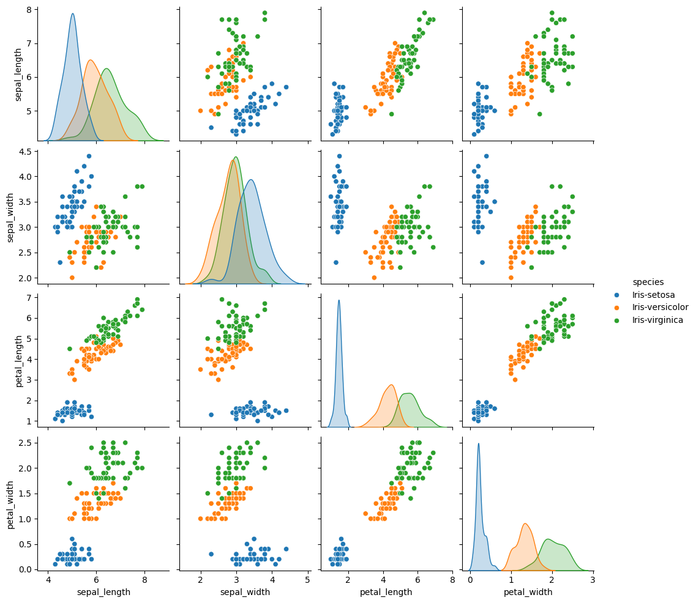

# 🌸 Iris Veri Seti Görselleştirme Projesi

Bu projede, klasik **Iris veri seti** kullanılarak temel veri görselleştirme uygulamaları gerçekleştirilmiştir. Amacımız, çiçek türlerini ayıran özellikleri grafiklerle daha iyi anlayabilmektir.

## 🔍 Proje Özeti

- 📊 Seaborn kütüphanesi ile veri görselleştirmeleri
- 🌼 3 farklı çiçek türü: *setosa*, *versicolor*, *virginica*
- 📈 Özellikler arası ilişkilerin detaylı gösterimi (pairplot)
- 🧠 Temel veri keşfi ve analiz pratiği

## 📂 Kullanılan Veri Seti

**Veri Kümesi:** `Iris`  
**Özellikler:**
- Sepal length (cm)
- Sepal width (cm)
- Petal length (cm)
- Petal width (cm)

**Hedef (target):**
- Çiçek türü (*species*)

## 🖼️ Örnek Görsel Çıktı

Bu görselde, türleri ayırmada taç yaprağın (petal) çanak yapraktan (sepal) daha güçlü olduğu görülebilir. Ayrıca petal_lenght ve petal_widh özellikleri arasında korelasyon olduğunu söyleyebiliriz. Çünkü birlikte azalma ve artma göstermişler.



## 🛠️ Kullanılan Teknolojiler

- Python 🐍
- Pandas
- Seaborn
- Matplotlib
- Google Colab

## 🚀 Nasıl Çalıştırılır?

1. Bu repoyu klonla:
   ```bash
   git clone https://github.com/senaskaya/iris-veri-analizi.git
